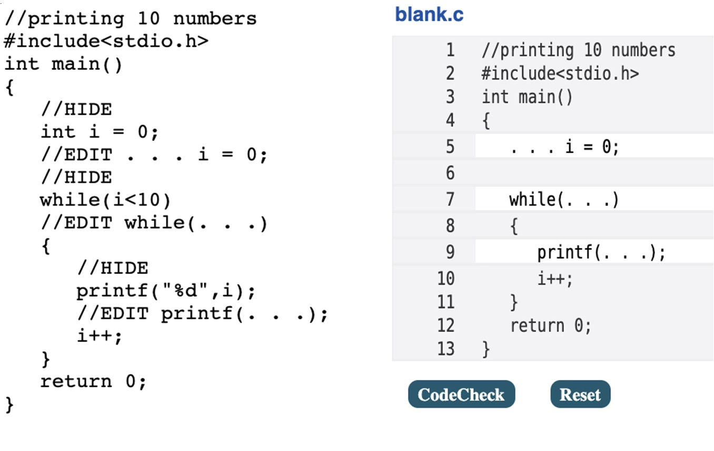

## Notes from the presentations given by faculty members Suraj Aravind B, Dr. M Kranthi Kiran and Dr. Jayasri Angara

### GitHub, GitHub Classroom and Replit

[Suraj Aravind B](https://vspgitcse.gitam.edu/faculty/profile/120035) has explained how he has used [Github](https://github.com), [Github Classroom](https://classroom.github.com) and [Replit](https://replit.com/@sbollapr) to share problems with students and also review problems done by students.

<iframe src="https://docs.google.com/presentation/d/e/2PACX-1vRbgPK5TBbyAhZ64RlK64NpmdVG2C3-MyDm2alQnwSV7D3wCgiLMkouAlGm-5sT2xe1vXYfQzzFfkyy/embed?start=true&loop=true&delayms=3000" frameborder="0" width="960" height="396" allowfullscreen="true" mozallowfullscreen="true" webkitallowfullscreen="true"></iframe>

Here are the [C programs used for explaining](https://replit.com/@sbollapr) concepts in class. They are organized and shared in Replit for students to experiment and play with the code.

### Code Check

[Dr. M Kranthi Kiran](https://vspgitcse.gitam.edu/faculty/profile/500621) has explained how he has used [Code Check](https://codecheck.io/) to create different problems for students. Here is the presentation.

<iframe src="https://docs.google.com/presentation/d/e/2PACX-1vS3kSQVCDct5kKlEl5RwmLna7yI7e5W330j7w-i965EGQb5AJdAreSjLQXPHeUrr40D-VtlWkajFk8K/embed?start=true&loop=true&delayms=3000" frameborder="0" width="960" height="396" allowfullscreen="true" mozallowfullscreen="true" webkitallowfullscreen="true"></iframe>

 

Author view and student view side by side.

You can play with live [fill in the blanks example](https://codecheck.io/files/2202040949a791qhz48fsfhvn8vxn0qwsju)
and [tiles example](https://codecheck.io/files/21122706043bpx7hnbs6x003o0o19bksfp2) and [tracing the code example](https://gitam-2021.github.io/trace/loop-walkthrough-1.xhtml).

### PADDY (Program A Day Initiative)
> "Towards Building Coditude"

[Dr. Jayasri Angara](https://vspgitcse.gitam.edu/Faculty) has explained about an process she is doing in her class to create a long term habit in students. Here is the presentation.

<iframe src="https://docs.google.com/presentation/d/e/2PACX-1vT3_zaMF0YHP7dTBrVXAtGOtmD8f4wd2zQtysIA0NZrmgfuhRGY2T1aTdirHotSqLsXCGHh2Y6TszKV/embed?start=true&loop=true&delayms=3000" frameborder="0" width="960" height="396" allowfullscreen="true" mozallowfullscreen="true" webkitallowfullscreen="true"></iframe>

When we can make student practice daily, in a way we are creating a coding habit, which makes him better and better in coding through out his whole career.

